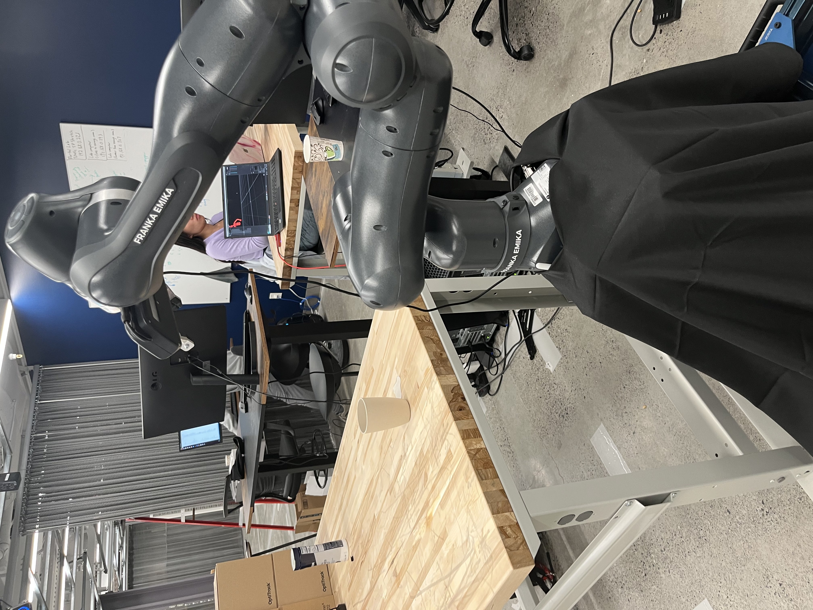

# Robotic-Grasp-Pose-Estimation
Robotic Grasp Pose Estimation using stereovision and a Franka Emika Panda arm. This was a project in which we used neural networks and DAgger reinforcement learning to predict an optimal grasp (represented as a point cloud) for an object in front of a robotic arm. We then experimentally actuated this grasp to test its performance.

The ROS files and the bulk of the actual code is on the arm, but I share the resultant video, data training samples we acquired, and research paper here. The results, including the arm actuation, is shown in the video below.

[Results Presentation](https://www.youtube.com/watch?v=X4GmfFWVYsQ)

